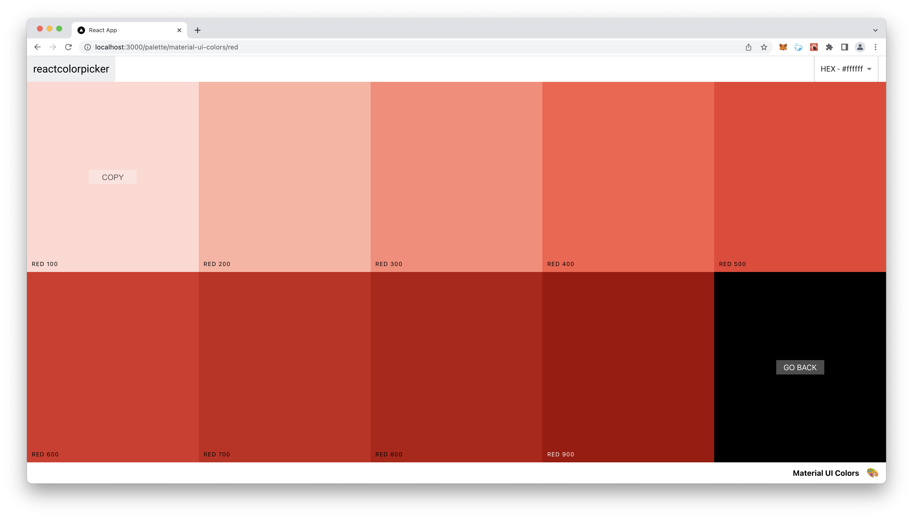

<div align="center">

  
  <h1>Color App</h1>
  
  <p>
    A color-picker and palette creating app made with React 
  </p>
  
  
<!-- Badges -->

[![Contributors][contributors-shield]][contributors-url]
![Last Commit][lastcommit-shield]
[![MIT License][license-shield]][license-url]
[![LinkedIn][linkedin-shield]][linkedin-url]

<h4>
    <a href="https://github.com/nbalabis/color-app/">View Demo</a>
  <span> · </span>
    <a href="https://github.com/nbalabis/color-app/issues/">Report Bug</a>
  </h4>
</div>

<br />

<!-- Table of Contents -->

# :notebook_with_decorative_cover: Table of Contents

- [About the Project](#star2-about-the-project)
  - [Screenshots](#camera-screenshots)
  - [Tech Stack](#space_invader-tech-stack)
  - [Features](#dart-features)
- [Getting Started](#toolbox-getting-started)
  - [Prerequisites](#bangbang-prerequisites)
  - [Run Locally](#running-run-locally)
- [License](#warning-license)
- [Contact](#handshake-contact)
- [Acknowledgements](#gem-acknowledgements)

<!-- About the Project -->

## :star2: About the Project

<!-- Screenshots -->

### :camera: Screenshots

<div align="center"> 
  
  
  
  
</div>

<!-- TechStack -->

### :space_invader: Tech Stack

[![React][react.js]][react-url]
[![MaterialUI][mui.js]][mui-url]
[![HTML5][html5.js]][html5-url]
[![CSS3][css3.js]][css3-url]

<!-- Features -->

### :dart: Features

- Create and save custom color palettes
- Copy hex, rgb, and rgba values from any saved palette
- View different light levels for each color

<!-- Getting Started -->

## :toolbox: Getting Started

<!-- Prerequisites -->

### :bangbang: Prerequisites

This project requires the latest versions of node and npm

<!-- Run Locally -->

### :running: Run Locally

Clone the project

```bash
  git clone https://github.com/nbalabis/color-app.git
```

Go to the project directory

```bash
  cd color-app
```

Install dependencies

```bash
  npm install
```

Start the server

```bash
  npm start
```

Runs the app in the development mode.\
Open [http://localhost:3000](http://localhost:3000) to view it in your browser.

The page will reload when you make changes.\
You may also see any lint errors in the console.

<!-- License -->

## :warning: License

Distributed under the MIT License. See LICENSE.txt for more information.

<!-- Contact -->

## :handshake: Contact

Nicholas Balabis - [LinkedIn](https://www.linkedin.com/in/nicholas-balabis-094571153/) - balabisnicholas@gmail.com

Project Link: [https://github.com/nbalabis/color-app](https://github.com/nbalabis/color-app)

<!-- Acknowledgments -->

## :gem: Acknowledgements

Some awesome libraries used for this project:

- [rc-slider](https://github.com/react-component/slider)
- [emoji-mart](https://github.com/missive/emoji-mart)
- [chroma-js](https://gka.github.io/chroma.js/)

Built with the help of:
 
- Colt Steele's [Modern React Bootcamp](https://www.udemy.com/course/modern-react-bootcamp/?utm_source=adwords&utm_medium=udemyads&utm_campaign=React_v.PROF_la.EN_cc.US_ti.7450&utm_content=deal4584&utm_term=_._ag_79286082406_._ad_532133511517_._kw__._de_c_._dm__._pl__._ti_dsa-774930034049_._li_9030078_._pd__._&matchtype=&gclid=Cj0KCQjwz96WBhC8ARIsAATR253VAr-06lVSB7NL3zJnGHIjpNQYRCsNzzlBPznigWpnLIXavB-Os5caAhw7EALw_wcB)

<!-- MARKDOWN LINKS & IMAGES -->

[linkedin-shield]: https://img.shields.io/badge/-LinkedIn-black.svg?style=for-the-badge&logo=linkedin&colorB=555
[linkedin-url]: https://www.linkedin.com/in/nicholas-balabis-094571153/
[contributors-shield]: https://img.shields.io/github/contributors/nbalabis/color-app.svg?style=for-the-badge
[contributors-url]: https://github.com/nbalabis/color-app/graphs/contributors
[lastcommit-shield]: https://img.shields.io/github/last-commit/nbalabis/color-app.svg?style=for-the-badge
[license-shield]: https://img.shields.io/github/license/nbalabis/color-app.svg?style=for-the-badge
[license-url]: https://github.com/nbalabis/color-app/blob/main/LICENSE
[react.js]: https://img.shields.io/badge/React-20232A?style=for-the-badge&logo=react&logoColor=61DAFB
[react-url]: https://reactjs.org/
[mui.js]: https://img.shields.io/badge/Material%20UI-007FFF?style=for-the-badge&logo=mui&logoColor=FFFFFF
[mui-url]: https://mui.com
[html5.js]: https://img.shields.io/badge/HTML5-E34F26?style=for-the-badge&logo=html5&logoColor=FFFFFF
[html5-url]: https://developer.mozilla.org/en-US/docs/Glossary/HTML5
[css3.js]: https://img.shields.io/badge/CSS3-d8dee3?style=for-the-badge&logo=css3&logoColor=1572B6
[css3-url]: https://developer.mozilla.org/en-US/docs/Web/CSS
